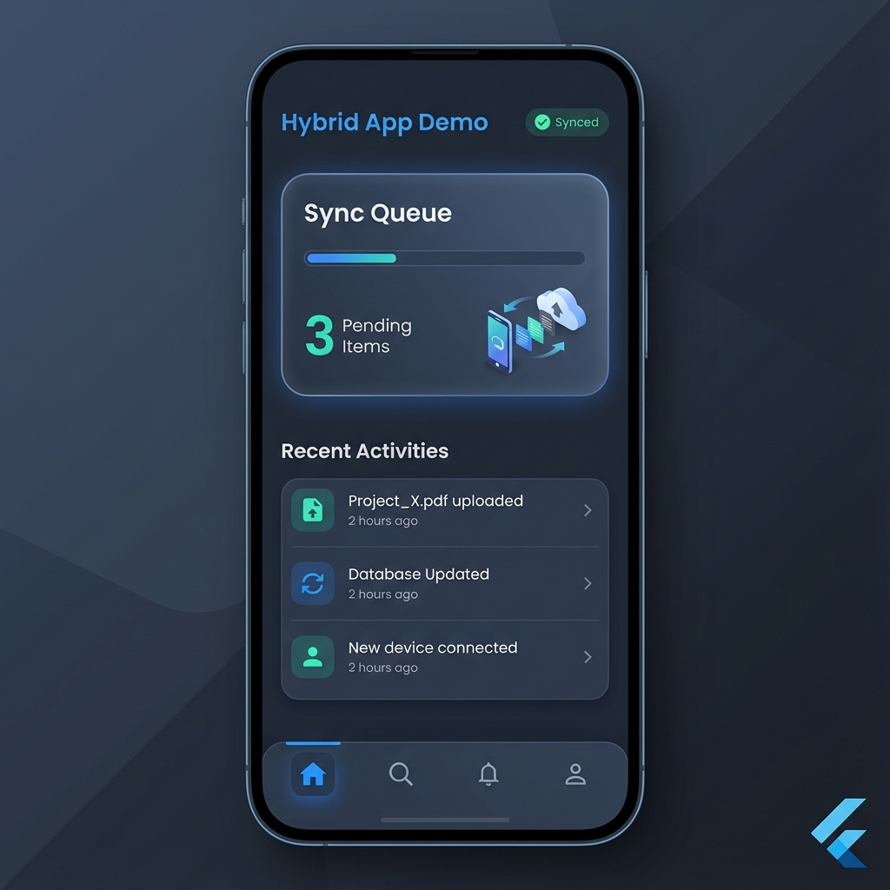

# Hybrid App Demo

This is a high-performance hybrid app demo built with Flutter, following Clean Architecture and Offline-First principles.

## Prerequisites
- Flutter SDK (Latest Stable)
- Dart SDK

## How to Run
1. Navigate to this directory:
   ```bash
   cd hybrid-app-demo
   ```
2. Install dependencies:
   ```bash
   flutter pub get
   ```
3. Run the app:
   ```bash
   flutter run
   ```

## Architecture
- **Core**: Shared logic (Network, Error handling).
- **Features**: Modular features (Auth, Sync).
- **State Management**: Bloc.
- **Database**: Drift (SQLite).

## Preview


